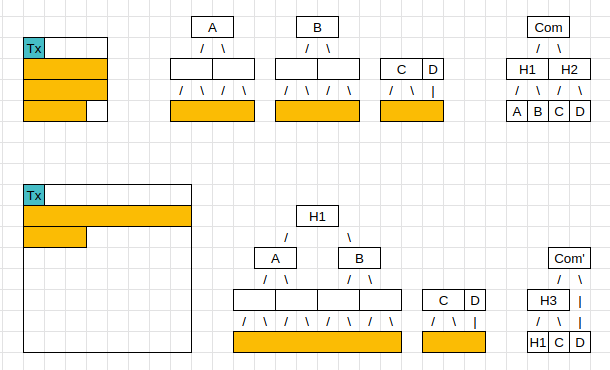
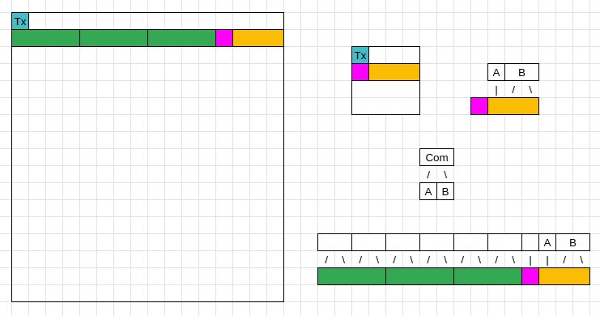
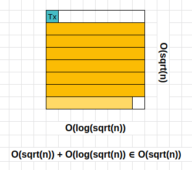
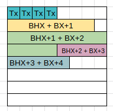

# ADR 008: square size independent message commitments

## Changelog

- 03.08.2022: Initial Draft

## Context

Currently, commitments in Celestia are dependent on the size of the square. The following diagram visualizes how this can happen. The visualizations in this ADR are without parity shares/erasure encoding.
The yellow block in the diagram is a message of length 11 shares. A square of 4x4 results in the following subtree roots: `A B C D`.
In [`CreateCommitment`](https://github.com/celestiaorg/celestia-app/blob/8b9c4c9d13fe0ccb6ea936cc26dee3f52b6f6129/x/blob/types/payforblob.go#L111-L117), we calculate the commitment of the subtree roots with [`HashFromByteSlices`](https://github.com/celestiaorg/celestia-core/blob/v0.34.x-celestia/crypto/merkle/tree.go#L7-L21). This resulting Merkleroot is `Com`.
A square of 8x8 results in the following subtree roots: `H1 C D`
[`HashFromByteSlices`](https://github.com/celestiaorg/celestia-core/blob/v0.34.x-celestia/crypto/merkle/tree.go#L7-L21) results now in the Merkleroot `Com'`, which is not equal to `Com`.



To have a commitment independent of the square size, you would need to create a Merkle tree over subtree roots that are included in every possible square size.
We agree on producing the commitment as if the message was put into the `msgMinSquareSize`. Therefore the subtree roots will be the same and the resulting commitment as well, no matter the square size. *This is because all the subtree roots in the `msgMinSquareSize` are also included in bigger square sizes*.
You can see this in the updated version of the diagram above. Now the Merkle root will stay the same. This property results from the square width and length being a power of 2. The diagram below has a msgMinSquareSize of 4.


You can see in the diagram below that no matter how the message is split up into rows, the hashes of the subtree roots stay the same.


This scheme also works for interactive commitments as long as the index of when a message starts is the same in every square size. In other words, the leaf nodes and leaf node pairs are independent of the square size.
For example, in the following diagram, you see the message starting at the second share and still having the same commitment. I marked the skipped blocks pink to show that both messages have the same starting index.


If the message starting point index is larger than the row of `msgMinSquareSize`, you take the index mod `msgMinSquareSize`. The `msgMinSquareSize` is shown in green, and the skipped block is in pink. In both cases, the commitment stays the same.



## Alternative Approaches

- [rollmint/adr-007](https://github.com/celestiaorg/rollmint/blob/cb5c7440a8e879778e71097e254c3dd692c39d14/docs/lazy-adr/adr-007-header-commit-to-shares.md)

## Decision

TODO

## Detailed Design

To implement this decision, you need to change [`CreateCommitment`](https://github.com/celestiaorg/celestia-app/blob/8b9c4c9d13fe0ccb6ea936cc26dee3f52b6f6129/x/blob/types/payforblob.go#L111-L117).
In detail, [`powerOf2MountainRange`](https://github.com/celestiaorg/celestia-app/blob/0c81704939cd743937aac2859f3cb5ae6368f174/x/payment/types/payfordata.go#L142) should take `msgMinSquareSize` as an argument instead of `squareSize`.

`msgMinSquareSize` can be calculated like this:

```go
// MsgMinSquareSize returns the minimum square size that msgSize can be included
// in. The returned square size does not account for the associated transaction
// shares or non-interactive defaults so it is a minimum.
func MsgMinSquareSize(msgSize uint64) uint64 {
	shareCount := uint64(shares.MsgSharesUsed(int(msgSize)))
	return MinSquareSize(shareCount)
}
// MinSquareSize returns the minimum square size that can contain shareCount
// number of shares disregarding non-interactive default rules for now
func MinSquareSize(shareCount uint64) uint64 {
	return shares.RoundUpPowerOfTwo(uint64(math.Ceil(math.Sqrt(float64(shareCount)))))
}
```

## Status

Implemented

## Consequences

### Negative

1. The amount of subtree roots per commitment is O(sqrt(n)), while n is the number of message shares. The worst case for the number of subtree roots is depicted in the diagram below - an entire block missing one share.
    
The worst case for the current implementation depends on the square size. If it is the worst square size, as in `msgMinSquareSize`, it is O(sqrt(n)) as well. On the other hand, if the message is only in one row, then it is O(log(n)).
Therefore the height of the tree over the subtree roots is in this implementation O(log(sqrt(n))), while n is the number of message shares. In the current implementation, it varies from O(log(sqrt(n))) to O(log(log(n))) depending on the square size.

2. With more subtree roots, the number of Merkle proofs will increase. With deeper subtree roots, the size of the Merkle proofs will increase. So instead of having a Merkle proof from the `DataRoot` to the `originalSubRoot` you will need the Merkle proof from `DataRoot` to `2^k` amount of `miniSubRoots` with `k` being the height difference of `originalSubRoot` and `miniSubRoots`. You can optimize this by having only **one** Merkle proof from `DataRoot` to `originalSubRoot` and then calculate the `originalSubRoot` from the `k` `miniSubRoots`. Because the Merkle proof is created after the block is published, we know the square size and, therefore, if this `originalSubRoot` exists or not.

### Positive Rollmint changes

1. A Rollup can include the commitment in the block header *before* posting to Celestia because it is size-independent and does not have to wait for Celestia to confirm the square size. In general, the roll-up needs access to this commitment in some form to verify a message inclusion proof guaranteeing data availability, which Rollmint currently does not have access to.
2. In turn, this would serve as an alternative to [rollmint/adr-007](https://github.com/celestiaorg/optimint/blob/main/docs/lazy-adr/adr-007-header-commit-to-shares.md)
3. Here is one scheme on how a Rollup might use this new commitment in the block header. Let's assume a Rollup that looks like this:
  BH1 <-- BH2 <-- BH3 <-- BH4
  The Messages that are submitted to Celestia could look like this:
  Message 1: B1
  The Commitment of B1 is saved into BH1.
  Message 2: (BH1+B2)
  The Commitment of BH1+B2 is saved into BH2.
  Message 3: (BH2+B3)
  The Commitment of (BH2+B3) is saved into BH3, and so on.
4. Verifying a message inclusion proof could be done with Merkle proofs of the subtree roots to the `DataRoot`, recalculating the commitment, and comparing to what's in the rollup block header. It could also be as simple as submitting proof over the PFB transaction that included the message and then checking if the commitment is the same as in the PFB transaction. The simple message inclusion proof requires a fraud-proof of the PFB transaction not to have included a message.
5. So far, a full node in Rollmint downloads new blocks from the DA Layer after each Celestia block, coupled tightly for syncing. With this approach, we can send blocks over the p2p Layer giving a soft commit to full nodes. Then, they would receive the hard commit after verifying a message inclusion proof without the need to download the blocks anymore. **P2P Blocksync** You could also achieve this by saving multiple commits for each possible square size in the block header.
    1. P2P Blocksync allows a Rollmint full node to run a Celestia light node and not a Celestia full node.
    2. It allows the Rollup node to continue running after Celestia halts, relying on soft commits with no data availability.
    3. It gives the Rollup the option to run asynchronously to Celestia because you don't have to wait for new Celestia blocks/commitments of the messages.
6. Combining P2P Blocksync and the scheme in 3, we could have multiple roll-up blocks in one Celestia block. It could look like this:
  
7. When submitting a message to Celestia, you only sign the message over one commitment and not all square sizes.

We should note that Rollups can decide to do this scheme without changing the core-app apart from Number 4.

## Positive celestia-app changes

- Simplifies the creation of PFBs because users don't need to create commitments for multiple square sizes.
  - Reduces the size of `MsgWirePayForBlob` because ShareCommitment can be modified from an array of maximum length 8 (for all valid square sizes) to a single ShareCommitment.
  - Simplifies the malleation process because this ADR enables a future refactor to remove WireMsgPayForBlob entirely ([issue](https://github.com/celestiaorg/celestia-app/issues/951)). Previously multiple signatures were included in a WireMsgPayForBlob and only one was used to construct the MsgPayForBlob that ended up on-chain but this ADR results in only one signature needed on the wrapping SDK message and the SDK message that ends up on-chain.
  - This renders the following issues obsolete:
    - <https://github.com/celestiaorg/celestia-app/issues/236>
    - <https://github.com/celestiaorg/celestia-app/issues/727>
- Simplifies arranging the square.
  - Currently, prepare proposal performs [`estimateSquareSize`](https://github.com/rootulp/celestia-app/blob/6f3b3ae437b2a70d72ff6be2741abb8b5378caa0/app/estimate_square_size.go#L98-L101) prior to splitting PFBs into shares because the square size is needed to malleate PFBs and extract the appropriate message share commitment for a particular square size. Since malleation no longer requires a square size, it may be possible to remove square size estimation which renders the following issues obsolete:
    - <https://github.com/informalsystems/audit-celestia/issues/12>
    - <https://github.com/informalsystems/audit-celestia/issues/24>
- Inter-message padding can be reduced in the worst case by 50% if we can change the non-interactive default rules. An in-depth analysis is performed at [ADR 009: New Non-Interactive Default Rules for Reduced Padding](./adr-009-non-interactive-default-rules-for-reduced-padding.md).
